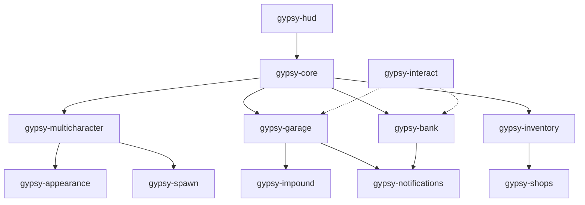

# Gypsy Framework - Modules Guide

> Подробное описание всех модулей фреймворка

---

## 📋 Содержание

- [Ядро](#ядро)
  - [gypsy-core](#gypsy-core)
  - [gypsy-loading](#gypsy-loading)
  - [gypsy-multicharacter](#gypsy-multicharacter)
- [Игровые системы](#игровые-системы)
  - [gypsy-appearance](#gypsy-appearance)
  - [gypsy-hud](#gypsy-hud)
  - [gypsy-inventory](#gypsy-inventory)
  - [gypsy-garage](#gypsy-garage)
  - [gypsy-impound](#gypsy-impound)
  - [gypsy-bank](#gypsy-bank)
  - [gypsy-shops](#gypsy-shops)
- [Вспомогательные](#вспомогательные)
  - [gypsy-interact](#gypsy-interact)
  - [gypsy-notifications](#gypsy-notifications)
  - [gypsy-vehicle](#gypsy-vehicle)
  - [gypsy-death](#gypsy-death)
  - [gypsy-spawn](#gypsy-spawn)
  - [gypsy-position](#gypsy-position)
  - [gypsy-weather](#gypsy-weather)
  - [gypsy-tweaks](#gypsy-tweaks)

---

## Ядро

### gypsy-core

**Описание:** Ядро фреймворка, предоставляющее базовую функциональность.

**Функции:**
- Service Locator для управления сервисами
- Event Bus для коммуникации между модулями
- Управление игроками (создание, загрузка, сохранение)
- Система денег (наличные, банк, сбережения)
- Система голода и жажды
- Управление работами и метаданными

**Конфигурация:**
```lua
-- config.lua
Config = {}
Config.Debug = true
Config.Locale = 'ru'
```

**База данных:**
- `players` — данные игроков
- `gypsy_vehicles` — транспорт
- `gypsy_inventory` — инвентарь

**Зависимости:**
- `oxmysql`

---

### gypsy-loading

**Описание:** Экран загрузки при подключении к серверу.

**Функции:**
- Кастомный UI с логотипом
- Прогресс-бар загрузки
- Советы для игроков
- Автоматическое скрытие после загрузки

**Конфигурация:**
Редактируйте `html/index.html` для изменения дизайна.

---

### gypsy-multicharacter

**Описание:** Система выбора и создания персонажей.

**Функции:**
- Выбор из существующих персонажей
- Создание нового персонажа
- Удаление персонажей
- Интеграция с системой внешности
- Камера для предпросмотра

**Конфигурация:**
```lua
-- config.lua
Config.StartingMoney = {
    cash = 5000,
    bank = 10000,
    savings = 0
}

Config.StartingPosition = {
    x = 0.0,
    y = 0.0,
    z = 0.0,
    heading = 0.0
}
```

**Зависимости:**
- `gypsy-core`
- `gypsy-appearance`

---

## Игровые системы

### gypsy-appearance

**Описание:** Редактор внешности персонажа.

**Функции:**
- Интеграция с `fivem-appearance`
- Сохранение внешности в БД
- Применение внешности при спавне
- Дефолтная одежда при создании

**API:**
```lua
-- Открыть редактор
exports['gypsy-appearance']:OpenAppearance(playerPed)

-- Применить сохраненную внешность
exports['gypsy-appearance']:ApplyAppearance(playerPed, appearanceData)
```

**Зависимости:**
- `gypsy-core`
- `fivem-appearance`

---

### gypsy-hud

**Описание:** HUD интерфейс игрока.

**Функции:**
- Здоровье, броня, выносливость
- Голод и жажда
- Индикатор микрофона
- День/ночь индикатор
- Транспортный HUD (скорость, топливо, здоровье двигателя)

**Конфигурация:**
```lua
-- config.lua
Config.UpdateInterval = 1000  -- Обновление каждую секунду
Config.VehicleUpdateInterval = 50  -- Обновление транспорта каждые 50мс
```

**Зависимости:**
- `gypsy-core`

---

### gypsy-inventory

**Описание:** Слотовая система инвентаря.

**Функции:**
- 30 слотов по умолчанию
- Использование предметов
- Перемещение предметов
- Выбрасывание предметов
- Drag & Drop UI

**Конфигурация:**
```lua
-- config.lua
Config.MaxSlots = 30
Config.MaxWeight = 120000  -- В граммах

Config.Items = {
    ['water'] = {
        name = 'water',
        label = 'Вода',
        weight = 500,
        type = 'item',
        image = 'water.png',
        unique = false,
        useable = true,
        description = 'Бутылка воды'
    },
    -- ...
}
```

**API:**
```lua
-- Добавить предмет
exports['gypsy-inventory']:AddItem(source, 'water', 1)

-- Убрать предмет
exports['gypsy-inventory']:RemoveItem(source, 'water', 1)

-- Получить количество
local count = exports['gypsy-inventory']:GetItemCount(source, 'water')
```

**Зависимости:**
- `gypsy-core`

---

### gypsy-garage

**Описание:** Система гаражей для хранения транспорта.

**Функции:**
- Парковка транспорта
- Спавн транспорта из гаража
- Сохранение топлива и повреждений
- Сохранение модификаций
- Блипы на карте
- Персистентность данных

**Конфигурация:**
```lua
-- config.lua
Config.Garages = {
    ["legion"] = {
        label = "Legion Square Garage",
        takeVehicle = vector4(215.5, -805.0, 30.8, 250.0),
        spawnPoint = vector4(215.5, -805.0, 30.8, 250.0),
        putVehicle = vector3(225.0, -795.0, 30.8),
        blip = { 
            sprite = 357, 
            color = 3, 
            scale = 0.8, 
            label = "Public Garage" 
        }
    }
}
```

**API:**
```lua
local GarageService = exports['gypsy-core']:GetService('Garage')

-- Припарковать
GarageService.ParkVehicle(plate, citizenid, garage, fuel, engine, body, mods)

-- Достать
GarageService.SpawnVehicle(plate, citizenid)

-- Получить список
local vehicles = GarageService.GetVehiclesByState(citizenid, 1)  -- 1 = в гараже
```

**Зависимости:**
- `gypsy-core`
- `gypsy-notifications`

---

### gypsy-impound

**Описание:** Система штрафплощадки и авто-эвакуации.

**Функции:**
- Штрафплощадка с UI
- Авто-эвакуация брошенных машин (каждые 30 минут)
- Оплата штрафа
- Спавн машины после оплаты
- Админ-команда `/impound`

**Конфигурация:**
```lua
-- config.lua
Config.ImpoundLocation = {
    coords = vector3(409.0, -1623.0, 29.3),
    blip = {
        sprite = 68,
        color = 17,
        scale = 0.8,
        label = "Штрафплощадка"
    }
}

Config.SpawnPoint = {
    coords = vector3(405.0, -1632.0, 29.3),
    heading = 230.0
}

Config.AutoImpoundTime = 30 * 60 * 1000  -- 30 минут
Config.DefaultFee = 500
Config.InteractionDistance = 2.5
```

**Команды:**
```bash
/impound ABC123  # Отправить машину на штрафплощадку
```

**Зависимости:**
- `gypsy-core`
- `gypsy-garage`
- `gypsy-notifications`

---

### gypsy-bank

**Описание:** Банковская система с ATM.

**Функции:**
- Ретро-футуристический UI "Amber Terminal"
- Снятие/внесение наличных
- Снятие/внесение в сбережения
- Real-time обновление балансов
- Валидация достаточности средств
- Блипы на карте для ATM и банков

**Конфигурация:**
```lua
-- config.lua
Config.ATMModels = {
    `prop_atm_01`,
    `prop_atm_02`,
    `prop_atm_03`,
    `prop_fleeca_atm`
}

Config.Banks = {
    {
        coords = vector3(149.9, -1040.5, 29.4),
        blip = {
            sprite = 108,
            color = 2,
            scale = 0.8,
            label = "Банк"
        }
    }
}
```

**Зависимости:**
- `gypsy-core`
- `gypsy-notifications`

---

### gypsy-shops

**Описание:** Система магазинов.

**Функции:**
- UI для покупки предметов
- Конфигурация магазинов
- Блипы на карте
- Интеграция с инвентарем

**Конфигурация:**
```lua
-- config.lua
Config.Shops = {
    ["247supermarket"] = {
        label = "24/7 Supermarket",
        coords = vector3(25.7, -1347.3, 29.5),
        blip = {
            sprite = 52,
            color = 2,
            scale = 0.8
        },
        items = {
            {name = "water", price = 10},
            {name = "bread", price = 15},
            -- ...
        }
    }
}
```

**Зависимости:**
- `gypsy-core`
- `gypsy-inventory`

---

## Вспомогательные

### gypsy-interact

**Описание:** Система взаимодействий (target).

**Функции:**
- Оптимизированный raycast (ShapeTest)
- Контекстное меню взаимодействий
- Поддержка NPC, игроков, объектов, транспорта
- Настраиваемая клавиша (по умолчанию Left Alt)

**Конфигурация:**
```lua
-- Встроенная в client/main.lua
local InteractConfig = {
    InteractKey = 19,       -- Left Alt
    MaxDistance = 5.0,
    RayRadius = 0.5,
    Debug = false
}
```

**API:**
```lua
-- Добавить взаимодействие для модели
exports['gypsy-interact']:AddTargetModel('prop_atm_01', {
    {
        label = "Использовать банкомат",
        icon = "fas fa-credit-card",
        action = function(entity)
            -- Код
        end
    }
})

-- Добавить для всех машин
exports['gypsy-interact']:AddGlobalVehicle({
    {
        label = "Открыть багажник",
        icon = "fas fa-box-open",
        event = "inventory:openTrunk"
    }
})

-- Добавить для всех педов
exports['gypsy-interact']:AddGlobalPed({
    {
        label = "Поздороваться",
        icon = "fas fa-hand-wave",
        action = function(entity)
            print('Hello!')
        end
    }
})
```

**Зависимости:**
Нет

---

### gypsy-notifications

**Описание:** Система уведомлений.

**Функции:**
- Красивые уведомления
- Типы: success, error, info, warning
- Настраиваемая длительность
- Анимации появления/исчезновения

**API:**
```lua
-- Client-side
exports['gypsy-notifications']:Notify('Сообщение', 'success', 3000)

-- Server-side
TriggerClientEvent('gypsy-notifications:client:notify', source, {
    message = 'Сообщение',
    type = 'error',
    duration = 3000
})
```

**Зависимости:**
Нет

---

### gypsy-vehicle

**Описание:** Управление транспортом.

**Функции:**
- Система ключей
- Блокировка/разблокировка
- Интеграция с гаражом

**Зависимости:**
- `gypsy-core`

---

### gypsy-death

**Описание:** Система смерти и возрождения.

**Функции:**
- Обработка смерти игрока
- Возрождение
- Регистрация в Service Locator

**Зависимости:**
- `gypsy-core`

---

### gypsy-spawn

**Описание:** Система спавна игроков.

**Функции:**
- Спавн на последней позиции
- Дефолтные точки спавна
- Интеграция с multicharacter

**Зависимости:**
- `gypsy-core`

---

### gypsy-position

**Описание:** Сохранение позиции игрока.

**Функции:**
- Автоматическое сохранение каждые 5 минут
- Сохранение при отключении
- Спавн на последней позиции

**Зависимости:**
- `gypsy-core`

---

### gypsy-weather

**Описание:** Синхронизация погоды и времени.

**Функции:**
- Синхронизация времени для всех игроков
- Смена погоды
- Уведомление HUD о времени суток

**Зависимости:**
- `gypsy-core`

---

### gypsy-tweaks

**Описание:** Игровые твики и настройки.

**Функции:**
- Отключение автоматического респавна
- Настройка игровых параметров
- Отключение ненужных элементов UI

**Зависимости:**
Нет

---

## Порядок загрузки

**Важно:** Модули должны загружаться в правильном порядке в `server.cfg`:

```cfg
# 1. Ядро (обязательно первым)
ensure gypsy-core

# 2. Базовые системы
ensure gypsy-loading
ensure gypsy-multicharacter
ensure gypsy-appearance
ensure gypsy-spawn
ensure gypsy-position

# 3. UI и вспомогательные
ensure gypsy-hud
ensure gypsy-notifications
ensure gypsy-interact

# 4. Игровые системы (порядок не критичен)
ensure gypsy-inventory
ensure gypsy-shops
ensure gypsy-garage
ensure gypsy-impound
ensure gypsy-bank
ensure gypsy-vehicle
ensure gypsy-death
ensure gypsy-tweaks
ensure gypsy-weather
```

---

## Взаимодействие модулей



---

## Рекомендации

### Обязательные модули

Для минимальной работы сервера необходимы:
- `gypsy-core`
- `gypsy-loading`
- `gypsy-multicharacter`
- `gypsy-spawn`

### Рекомендуемые модули

Для полноценного игрового опыта:
- `gypsy-hud`
- `gypsy-notifications`
- `gypsy-inventory`
- `gypsy-garage`

### Опциональные модули

Можно отключить без потери базового функционала:
- `gypsy-impound`
- `gypsy-bank`
- `gypsy-shops`
- `gypsy-weather`

---

## Производительность

### Оптимизированные модули

- ✅ `gypsy-interact` — использует ShapeTest вместо GetGamePool
- ✅ `gypsy-hud` — обновление 1000мс для статусов, 50мс для транспорта
- ✅ `gypsy-garage` — агрессивная синхронизация только при спавне

### Рекомендации по оптимизации

1. **Отключите ненужные модули** в `server.cfg`
2. **Увеличьте интервалы обновления** в конфигах (если не критично)
3. **Используйте Event Bus** вместо постоянных проверок
4. **Кэшируйте данные** где возможно

---

## Дополнительные ресурсы

- [API Reference](API.md)
- [Development Guide](DEVELOPMENT.md)
- [GitHub](https://github.com/yourusername/gypsy-framework)
