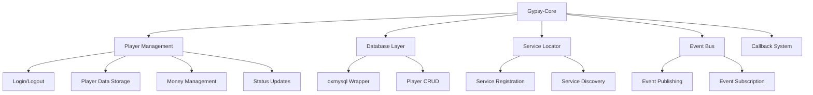

# Gypsy-Core

**Version:** 1.0.0  
**Author:** Antigravity

Core module of the Gypsy Framework providing player management, database abstraction, Service Locator pattern, and Event Bus system.

---

## Architecture Overview



---

## Core Components

### 1. Player Management

#### Server-Side (`Gypsy.Players`)

Global table storing all connected players:

```lua
Gypsy.Players[source] = {
    citizenid = string,      -- Unique player ID
    license = string,        -- FiveM license
    name = string,           -- Player name
    money = {                -- Money balances
        cash = number,
        bank = number,
        savings = number
    },
    job = table,             -- Job data
    position = {             -- Last known position
        x = number,
        y = number,
        z = number,
        w = number (heading)
    },
    metadata = {             -- Player stats
        hunger = number,
        thirst = number
    },
    charinfo = table,        -- Character info (appearance, etc.)
    Functions = {            -- Player-specific functions
        AddMoney = function,
        RemoveMoney = function,
        GetMoney = function
    }
}
```

#### Client-Side (`Gypsy.PlayerData`)

Local copy of player data synchronized from server.

---

### 2. Database Layer

#### `Gypsy.Functions.ExecuteSql(query, parameters, callback)`

Wrapper for oxmysql execute operations.

**Example:**
```lua
Gypsy.Functions.ExecuteSql('UPDATE players SET money = ? WHERE citizenid = ?', {
    json.encode(money),
    citizenid
}, function(result)
    print('Rows affected: ' .. result)
end)
```

---

### 3. Service Locator Pattern

Enables modular architecture where modules register themselves as services.

#### Server-Side Exports

**Register a Service:**
```lua
exports['gypsy-core']:RegisterService('MyService', {
    name = 'MyService',
    version = '1.0.0',
    DoSomething = function()
        -- Service logic
    end
})
```

**Get a Service:**
```lua
local MyService = exports['gypsy-core']:GetService('MyService')
if MyService then
    MyService:DoSomething()
end
```

**Check Service Availability:**
```lua
if exports['gypsy-core']:HasService('MyService') then
    -- Service is available
end
```

---

### 4. Event Bus System

Decoupled event communication between modules.

#### Server-Side Exports

**Subscribe to Event:**
```lua
exports['gypsy-core']:On('player:moneyChanged', function(source, newAmount)
    print('Player ' .. source .. ' money changed to ' .. newAmount)
end)
```

**Publish Event:**
```lua
exports['gypsy-core']:Emit('player:moneyChanged', source, newMoney)
```

**Unsubscribe:**
```lua
exports['gypsy-core']:Off('player:moneyChanged', callbackFunction)
```

---

## Key Functions

### Server-Side

#### `Gypsy.Functions.GetPlayer(source)`
Returns player data for given source.

```lua
local Player = exports['gypsy-core']:GetPlayer(source)
if Player then
    print(Player.citizenid)
end
```

#### `Gypsy.Functions.Login(source, citizenid, newData)`
Handles player login or creation.

#### `Gypsy.Functions.SavePlayer(source)`
Saves player data to database.

```lua
Gypsy.Functions.SavePlayer(source)
```

#### `Gypsy.Functions.CreateCitizenId()`
Generates unique 8-digit citizen ID.

---

### Client-Side

#### `Gypsy.Functions.GetPlayerData()`
Returns local player data.

```lua
local playerData = exports['gypsy-core']:GetCoreObject().Functions.GetPlayerData()
print(playerData.citizenid)
```

#### `Gypsy.Functions.TriggerCallback(name, callback, ...)`
Triggers server callback and handles response.

```lua
Gypsy.Functions.TriggerCallback('myCallback', function(result)
    print(result)
end, arg1, arg2)
```

---

## Events

### Server Events

| Event | Parameters | Description |
|-------|-----------|-------------|
| `gypsy:join` | - | Triggered when player connects |
| `gypsy-core:internal:login` | source | Internal login handler |
| `playerDropped` | reason | Player disconnected |

### Client Events

| Event | Parameters | Description |
|-------|-----------|-------------|
| `gypsy-core:client:playerLoaded` | playerData | Player data loaded from server |
| `gypsy:client:coreReady` | - | Core initialization complete |
| `gypsy:client:forceReload` | - | Hot-reload triggered |
| `gypsy-core:client:updateStatus` | metadata | Status update (hunger/thirst) |

---

## Database Schema

### `players` Table

```sql
CREATE TABLE IF NOT EXISTS `players` (
  `id` int(11) NOT NULL AUTO_INCREMENT,
  `citizenid` varchar(50) NOT NULL,
  `license` varchar(50) NOT NULL,
  `name` varchar(255) NOT NULL,
  `money` text DEFAULT NULL,
  `charinfo` text DEFAULT NULL,
  `job` text DEFAULT NULL,
  `position` text DEFAULT NULL,
  `metadata` text DEFAULT NULL,
  PRIMARY KEY (`citizenid`),
  KEY `id` (`id`),
  KEY `license` (`license`)
) ENGINE=InnoDB AUTO_INCREMENT=1 DEFAULT CHARSET=utf8mb4;
```

**JSON Fields:**
- `money`: `{"cash": 0, "bank": 0, "savings": 0}`
- `position`: `{"x": 0, "y": 0, "z": 0, "w": 0}`
- `metadata`: `{"hunger": 100, "thirst": 100}`
- `charinfo`: Character appearance and info
- `job`: Job data

---

## Configuration

### `config.lua`

```lua
Config = {}
Config.UpdateInterval = 60000  -- Status update interval (ms)
```

---

## Hot-Reload Support

Gypsy-Core supports hot-reloading without disconnecting players:

1. Server detects resource restart
2. Reloads all connected players from database
3. Triggers `gypsy:client:forceReload` on clients
4. Clients reset state and wait for `playerLoaded` event

---

## Status System

Automatic hunger/thirst degradation every 60 seconds:

```lua
-- Server-side loop
CreateThread(function()
    while true do
        Wait(60000)
        for src, player in pairs(Gypsy.Players) do
            player.metadata.hunger = (player.metadata.hunger or 100) - 1
            player.metadata.thirst = (player.metadata.thirst or 100) - 2
            
            if player.metadata.hunger <= 0 or player.metadata.thirst <= 0 then
                -- Apply damage
            end
            
            TriggerClientEvent('gypsy-core:client:updateStatus', src, player.metadata)
        end
    end
end)
```

---

## Best Practices

### 1. Accessing Player Data

**✅ Correct:**
```lua
local Player = exports['gypsy-core']:GetPlayer(source)
if Player then
    Player.Functions.AddMoney('cash', 100)
end
```

**❌ Incorrect:**
```lua
-- Don't modify Gypsy.Players directly from other resources
_G.Gypsy.Players[source].money.cash = 100
```

### 2. Service Registration

Register services **after** `gypsy-core` is started:

```lua
CreateThread(function()
    while GetResourceState('gypsy-core') ~= 'started' do
        Wait(100)
    end
    
    exports['gypsy-core']:RegisterService('MyService', {...})
end)
```

### 3. Event Bus vs Native Events

Use Event Bus for **cross-module** communication:
```lua
-- ✅ Good for module-to-module
exports['gypsy-core']:Emit('inventory:itemUsed', source, itemName)
```

Use native events for **internal** module communication:
```lua
-- ✅ Good for same-resource events
TriggerEvent('myresource:internal:doSomething')
```

---

## Troubleshooting

### Player Data Not Saving

1. Check `oxmysql` is running
2. Verify database connection string in `server.cfg`
3. Check server console for SQL errors
4. Ensure `SavePlayer()` is called on `playerDropped`

### Service Not Found

1. Ensure service resource starts **after** `gypsy-core`
2. Check `ensure` order in `server.cfg`
3. Verify service registration code runs

### Hot-Reload Issues

1. Check for errors in server console during reload
2. Verify database connection is stable
3. Ensure `playerLoaded` event is triggered

---

## Dependencies

- **oxmysql**: Database driver
- **FiveM**: Server version cerulean or higher

---

## License

Proprietary - Gypsy Framework
